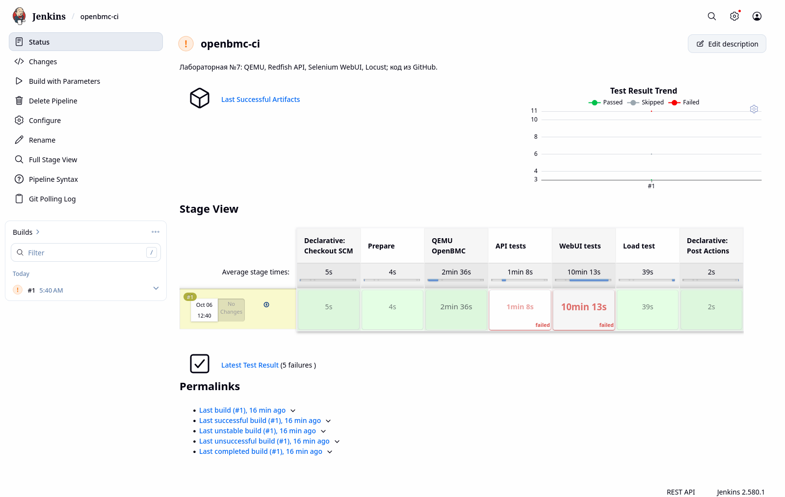
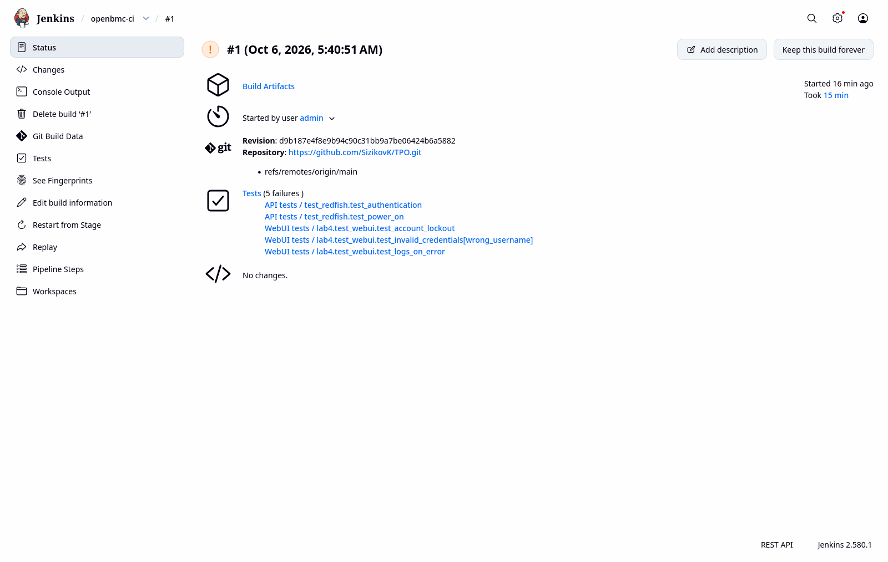
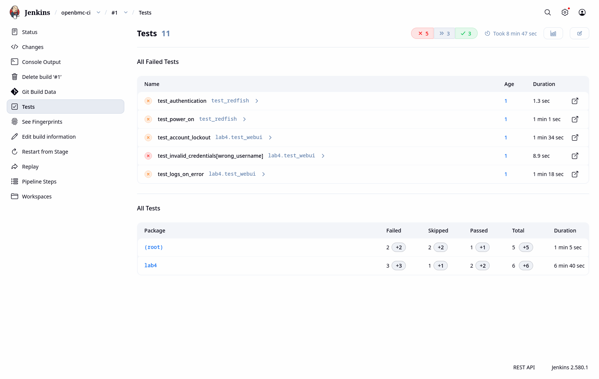

# Лабораторная работа №7. CI/CD с GitHub и Jenkins в Docker

**Дата выполнения: 06.10.2026.**

## Цель работы

Ознакомиться с CI/CD в контексте OpenBMC: хранить Pipeline в GitHub, развернуть Jenkins в Docker, автоматически запускать QEMU, API-тесты, Web UI-тесты и нагрузочное тестирование, публиковать отчёты каждого этапа в Jenkins.

## Реализация и файлы

- [Jenkinsfile](Jenkinsfile): Declarative Pipeline на Groovy.
- [Dockerfile](Dockerfile), [compose.yaml](compose.yaml): Jenkins LTS с Java 21, QEMU, Firefox ESR, geckodriver и зависимостями тестов.
- [plugins.txt](plugins.txt): Pipeline, Git, JUnit и Stage View; фактически установленные версии записаны в results/jenkins-plugins.txt.
- [init.groovy.d/01-setup.groovy](init.groovy.d/01-setup.groovy): локальный администратор и задание openbmc-ci, использующее Jenkinsfile из GitHub.
- [ci.py](ci.py): запуск QEMU, ожидание готовности API, выполнение исходных тестов и сохранение отчётов.
- [jenkins_api.py](jenkins_api.py): управление сборкой и скачивание настоящих артефактов через API Jenkins; пароль не выводится.
- [DEFENSE.md](DEFENSE.md): команды и шаги для демонстрации преподавателю.

Jenkins доступен на http://localhost:18080, контейнер tpo-lab7-jenkins. В контейнер подключена существующая прошивка `investigation/romulus-20250902/image.static.mtd` как `/opt/openbmc/image.static.mtd`, только для чтения. QEMU запускается в режиме `-snapshot`, HTTPS BMC доступен внутри контейнера на `https://127.0.0.1:3443`; внешние порты QEMU не публикуются. Docker socket контейнеру не передаётся. Для учебного стенда этапы выполняются единственным executor Jenkins внутри этого контейнера.

GitHub используется как SCM: `https://github.com/SizikovK/TPO.git`, ветка `main`, Script Path `lab7/Jenkinsfile`. Pipeline получает код из репозитория, а `pollSCM('H/15 * * * *')` после первого запуска проверяет изменения каждые 15 минут. Это настройка автоматического CI; для проверки выполнена ручная сборка. Отчёты поставляются как Jenkins artifacts. Деплой прошивки на физическое оборудование в методичке не требуется и в работе не выполнялся.

## 1. Docker и подготовка Jenkins

Команды выполняются из каталога TPO. Доступ Docker Desktop проверен; клиент 29.8.1, сервер 29.6.2, Compose v5.3.1.

```bash
docker version --format 'Client={{.Client.Version}} Server={{.Server.Version}}'
```

Вывод:

````text
Client=29.8.1 Server=29.6.2
````

```bash
python3 lab7/setup_env.py
```

Вывод:

````text
Создан lab7/.env (0600); пароль не выводится и не включается в Git
````

Локальный файл .env содержит JENKINS_ADMIN_USER и JENKINS_ADMIN_PASSWORD, исключён из Git и контекста Docker build. Он не приложен к отчёту. Jenkins требует аутентификацию; анонимное чтение отключено.

```bash
docker compose --env-file lab7/.env -f lab7/compose.yaml config --quiet
```

Вывод:

````text
(Вывод отсутствует; код завершения 0.)
````

```bash
docker compose --env-file lab7/.env -f lab7/compose.yaml build > lab7/results/docker-build.txt 2>&1
tail -30 lab7/results/docker-build.txt
```

Вывод:

````text
#11 71.78
#11 71.79 Successfully installed attrs-26.1.0 bidict-0.24.1 blinker-1.9.0 brotli-1.2.0 certifi-2026.7.22 charset_normalizer-3.5.2 click-8.5.0 configargparse-1.8.0 flask-3.1.3 flask-cors-6.0.5 flask-login-0.6.3 gevent-26.9.0 geventhttpclient-2.5.1 greenlet-3.5.6 h11-0.16.0 idna-3.20 iniconfig-2.3.0 itsdangerous-2.2.0 jinja2-3.1.6 locust-2.46.7 markupsafe-3.0.4 msgpack-1.2.3 outcome-1.3.0.post0 packaging-26.3 pluggy-1.6.0 psutil-7.2.2 pygments-2.21.0 pysocks-1.7.1 pytest-9.1.1 python-engineio-4.14.0 python-socketio-5.17.0 pyzmq-27.2.0 requests-2.34.2 selenium-4.49.0 simple-websocket-1.1.0 sniffio-1.3.1 sortedcontainers-2.4.0 trio-0.34.0 trio-websocket-0.12.2 typing_extensions-4.16.0 urllib3-2.8.0 websocket-client-1.9.2 werkzeug-3.1.9 wsproto-1.3.2 zope.event-6.2 zope.interface-8.6
#11 DONE 72.8s

#12 [6/8] COPY plugins.txt /usr/share/jenkins/ref/plugins.txt
#12 DONE 0.1s

#13 [7/8] RUN jenkins-plugin-cli --plugin-file /usr/share/jenkins/ref/plugins.txt
#13 119.8 Done
#13 DONE 119.9s

#14 [8/8] COPY init.groovy.d/ /usr/share/jenkins/ref/init.groovy.d/
#14 DONE 0.1s

#15 exporting to image
#15 exporting layers
#15 exporting layers 37.8s done
#15 exporting manifest sha256:5973e3a05f3e8cc9cfd8ac835ec682c45d74db8e078bd6d1fa48c815a9ed162e 0.0s done
#15 exporting config sha256:e9151b513e5585ed18c467ed3e527e691199457f1f76bbdd064d9ce6e64b6b5d 0.0s done
#15 exporting attestation manifest sha256:605d7e4d44db2a7c776e9dc37380187a5cac56f765d65a63df317793143f2a9f 0.1s done
#15 exporting manifest list sha256:66a8da4c6f0c2a21e4a8f3dd6e4a825f7764c174ce28b1dcb4c77fc3487fa7ce
#15 exporting manifest list sha256:66a8da4c6f0c2a21e4a8f3dd6e4a825f7764c174ce28b1dcb4c77fc3487fa7ce 0.0s done
#15 naming to docker.io/library/tpo-lab7-jenkins:local done
#15 unpacking to docker.io/library/tpo-lab7-jenkins:local
#15 unpacking to docker.io/library/tpo-lab7-jenkins:local 7.3s done
#15 DONE 45.4s

#16 resolving provenance for metadata file
#16 DONE 0.2s
 Image tpo-lab7-jenkins:local Built
````

Полный вывод сборки без сокращений: [docker-build.txt](results/docker-build.txt). Образ успешно собран; выбранный официальный базовый образ разрешился в digest `sha256:a660310e39ade10631f774bacd5219de767dfd08947ea5c32a739b5e5bb382c1`.

```bash
docker compose --env-file lab7/.env -f lab7/compose.yaml up -d > lab7/results/docker-up.txt 2>&1
cat lab7/results/docker-up.txt
```

Вывод:

````text
 Network tpo-lab7_default Creating
 Network tpo-lab7_default Created
 Volume tpo-lab7_jenkins_home Creating
 Volume tpo-lab7_jenkins_home Created
 Container tpo-lab7-jenkins Creating
 Container tpo-lab7-jenkins Created
 Container tpo-lab7-jenkins Starting
 Container tpo-lab7-jenkins Started
````

В процессе проверки удалён лишний `init: true`: официальный Jenkins image уже запускает tini. Конфигурация применена пересозданием контейнера с сохранением именованного тома Jenkins:

```bash
docker compose --env-file lab7/.env -f lab7/compose.yaml up -d > lab7/results/docker-recreate.txt 2>&1
cat lab7/results/docker-recreate.txt
```

Вывод:

````text
 Container tpo-lab7-jenkins Recreate
 Container tpo-lab7-jenkins Recreated
 Container tpo-lab7-jenkins Starting
 Container tpo-lab7-jenkins Started
````

```bash
docker compose --env-file lab7/.env -f lab7/compose.yaml ps
```

Вывод:

````text
NAME               IMAGE                    COMMAND                  SERVICE   CREATED        STATUS                  PORTS
tpo-lab7-jenkins   tpo-lab7-jenkins:local   "/usr/bin/tini -- /u…"   jenkins   1 second ago   Up Less than a second   127.0.0.1:18080->8080/tcp
````

```bash
python3 lab7/jenkins_api.py status > lab7/results/jenkins-status.txt 2>&1
cat lab7/results/jenkins-status.txt
```

Вывод:

````text
{
  "_class": "hudson.model.Hudson",
  "mode": "NORMAL",
  "jobs": [
    {
      "_class": "org.jenkinsci.plugins.workflow.job.WorkflowJob",
      "name": "openbmc-ci",
      "color": "notbuilt"
    }
  ],
  "quietingDown": false
}
````

```bash
docker exec tpo-lab7-jenkins java -jar /usr/share/jenkins/jenkins.war --version
```

Вывод:

````text
2.580.1
````

Идентификатор собранного образа: `sha256:66a8da4c6f0c2a21e4a8f3dd6e4a825f7764c174ce28b1dcb4c77fc3487fa7ce`.

## 2. Jenkinsfile и этапы Pipeline

1. **Prepare**: проверка зависимостей, запись commit Git и SHA-256 прошивки. Старые отчёты удаляются только в отдельном Jenkins WORKSPACE, чтобы не принять результаты прошлых лабораторных за новый прогон.
2. **QEMU OpenBMC**: настоящий `qemu-system-arm -M romulus-bmc -m 256 -snapshot`; опрос `/redfish/v1/Systems/system` до HTTP 200. Сохраняются команда, boot.log, system.json и summary.md.
3. **API tests**: запуск всех пяти тестов из lab5/test_redfish.py. Строгие ожидания методички №5 (200 для сессии, 202 и On для включения) сохранены. Сохраняются JUnit XML, лог, код завершения и фактические ответы.
4. **WebUI tests**: остановка предыдущего QEMU и запуск свежего снимка; все шесть проверок lab4/test_webui.py в headless Firefox. Это исключает влияние запроса питания из API-теста. Сохраняются JUnit XML, полный вывод, скриншоты и текст страниц.
5. **Load test**: только OpenBMCUser из lab6/locustfile.py — 10 пользователей, скорость 2 пользователя/с, 30 с. Читаются системная информация и PowerState; публичные API в этой лабораторной не нагружаются. Сохраняются CSV, HTML и полный вывод.

`disableConcurrentBuilds()` не позволяет двум сборкам одновременно занимать порты QEMU. Общий тайм-аут Pipeline — 25 минут; ожидание готовности QEMU — 240 с. Тестовые ошибки обрабатываются через `catchError(buildResult: 'UNSTABLE', stageResult: 'FAILURE')`: они видны в Jenkins, последующие проверки продолжаются. `junit` публикует результаты тестов; `archiveArtifacts` вызывается в post/always каждого этапа. Общий post/always останавливает QEMU и архивирует все результаты, включая cleanup.txt. allowEmptyArchive используется для аварийных ситуаций, но в выполненной сборке наличие артефактов каждого требуемого этапа отдельно проверено.

Синтаксис и публикация результатов основаны на документации Jenkins: [Declarative Pipeline](https://www.jenkins.io/doc/book/pipeline/syntax/), [catchError](https://www.jenkins.io/doc/pipeline/steps/workflow-basic-steps/#catcherror-catch-error-and-set-build-result-to-failure), [JUnit и артефакты](https://www.jenkins.io/doc/pipeline/tour/tests-and-artifacts/), [Jenkins в Docker](https://www.jenkins.io/doc/book/installing/docker/).

## 3. Валидация и реальный запуск

Первый запрос вспомогательного HTTP-клиента к валидатору не передавал Jenkinsfile как текстовое поле. Формат исправлен; повторная проверка успешна:

```bash
python3 lab7/jenkins_api.py validate
```

Вывод:

````text
Jenkinsfile successfully validated.
````

```bash
python3 lab7/jenkins_api.py build
```

Вывод:

````text
Pipeline поставлен в очередь: http://127.0.0.1:18080/queue/item/1/
````

```bash
python3 lab7/jenkins_api.py watch > lab7/results/pipeline-watch.txt 2>&1
cat lab7/results/pipeline-watch.txt
```

Вывод:

````text
Build #1: []
Build #1: [('Declarative: Checkout SCM', 'SUCCESS'), ('Prepare', 'IN_PROGRESS')]
Build #1: [('Declarative: Checkout SCM', 'SUCCESS'), ('Prepare', 'SUCCESS'), ('QEMU OpenBMC', 'IN_PROGRESS')]
Build #1: [('Declarative: Checkout SCM', 'SUCCESS'), ('Prepare', 'SUCCESS'), ('QEMU OpenBMC', 'SUCCESS'), ('API tests', 'IN_PROGRESS')]
Build #1: [('Declarative: Checkout SCM', 'SUCCESS'), ('Prepare', 'SUCCESS'), ('QEMU OpenBMC', 'SUCCESS'), ('API tests', 'FAILED'), ('WebUI tests', 'IN_PROGRESS')]
Build #1: [('Declarative: Checkout SCM', 'SUCCESS'), ('Prepare', 'SUCCESS'), ('QEMU OpenBMC', 'SUCCESS'), ('API tests', 'FAILED'), ('WebUI tests', 'FAILED'), ('Load test', 'IN_PROGRESS')]
Build #1: [('Declarative: Checkout SCM', 'SUCCESS'), ('Prepare', 'SUCCESS'), ('QEMU OpenBMC', 'SUCCESS'), ('API tests', 'FAILED'), ('WebUI tests', 'FAILED'), ('Load test', 'SUCCESS'), ('Declarative: Post Actions', 'SUCCESS')]
Build #1: UNSTABLE; duration=909125 ms
````

**Реальная сборка: openbmc-ci #1, результат UNSTABLE, длительность 909.12 с.**

| Этап Jenkins | Фактический статус | Время, с |
| --- | --- | ---: |
| Declarative: Checkout SCM | SUCCESS | 5.23 |
| Prepare | SUCCESS | 4.39 |
| QEMU OpenBMC | SUCCESS | 156.93 |
| API tests | FAILED | 68.77 |
| WebUI tests | FAILED | 613.73 |
| Load test | SUCCESS | 39.69 |
| Declarative: Post Actions | SUCCESS | 2.16 |

Полный [Console Output](results/build-1/console.txt) и [статусы этапов](results/build-1/stages.json) сохранены без подмены.

### Окружение фактической сборки

Артефакт Prepare:

# Окружение CI


```text
$ python --version
Python 3.13.5

$ qemu-system-arm --version
QEMU emulator version 10.0.13 (Debian 1:10.0.13+ds-0+deb13u1)
Copyright (c) 2003-2025 Fabrice Bellard and the QEMU Project developers

$ firefox --version
Mozilla Firefox 153.4.0esr
[1084] Sandbox: CanCreateUserNamespace() clone() failure: EPERM

$ geckodriver --version
geckodriver 0.37.1 (300705c65d1b 2026-07-17 09:25 +0000)

The source code of this program is available from
testing/geckodriver in https://hg.mozilla.org/mozilla-central.

This program is subject to the terms of the Mozilla Public License 2.0.
You can obtain a copy of the license at https://mozilla.org/MPL/2.0/.

$ ipmitool -V
ipmitool version 1.8.19

$ locust --version
locust 2.46.7 from /opt/test-venv/lib/python3.13/site-packages/locust (Python 3.13.5)

$ git rev-parse HEAD
d9b187e4f8e9b94c90c31bb9a7be06424b6a5882

$ sha256sum /opt/openbmc/image.static.mtd
0d6bc73c8641555d1df0e8eb9c0ae5d64cdae14e0b819c151fd56686d9d3d764  /opt/openbmc/image.static.mtd

```


### Запуск QEMU

Команда, исполненная внутри контейнера:

```bash
qemu-system-arm -M romulus-bmc -m 256 -snapshot -drive file=/opt/openbmc/image.static.mtd,format=raw,if=mtd -nographic -net nic -net user,hostfwd=tcp:127.0.0.1:3443-:443,hostfwd=udp:127.0.0.1:3623-:623
```

Отчёт этапа:

# Запуск OpenBMC в QEMU

QEMU PID: 1122. API доступен: HTTP 200.

PowerState: Off. Попыток проверки готовности: 24.

Режим -snapshot: исходная прошивка не изменяется.


Полный журнал загрузки: [boot.log](results/build-1/artifacts/qemu/boot.log).

### API-тесты: команда и полный вывод

```bash
/opt/test-venv/bin/python -m pytest lab5/test_redfish.py -v -ra --tb=short --junitxml=/var/jenkins_home/workspace/openbmc-ci/lab7/results/api/junit.xml -o log_file=/var/jenkins_home/workspace/openbmc-ci/lab7/results/api/pytest.log

```

Вывод:

````text
============================= test session starts ==============================
platform linux -- Python 3.13.5, pytest-9.1.1, pluggy-1.6.0 -- /opt/test-venv/bin/python
cachedir: .pytest_cache
rootdir: /var/jenkins_home/workspace/openbmc-ci/lab5
configfile: pytest.ini
plugins: locust-2.46.7
collecting ... collected 5 items

lab5/test_redfish.py::test_authentication
-------------------------------- live log setup --------------------------------
INFO     test_redfish:test_redfish.py:30 POST /redfish/v1/SessionService/Sessions -> HTTP 201
FAILED                                                                   [ 20%]
lab5/test_redfish.py::test_system_information
-------------------------------- live log call ---------------------------------
INFO     test_redfish:test_redfish.py:30 GET /redfish/v1/Systems/system -> HTTP 200
INFO     test_redfish:test_redfish.py:82 Status={'Health': 'OK', 'State': 'Disabled'}; PowerState=Off
PASSED                                                                   [ 40%]
lab5/test_redfish.py::test_power_on
-------------------------------- live log call ---------------------------------
INFO     test_redfish:test_redfish.py:30 GET /redfish/v1/Systems/system -> HTTP 200
INFO     test_redfish:test_redfish.py:30 POST /redfish/v1/Systems/system/Actions/ComputerSystem.Reset -> HTTP 204
INFO     test_redfish:test_redfish.py:30 GET /redfish/v1/Systems/system -> HTTP 200
INFO     test_redfish:test_redfish.py:30 GET /redfish/v1/Systems/system -> HTTP 200
INFO     test_redfish:test_redfish.py:30 GET /redfish/v1/Systems/system -> HTTP 200
INFO     test_redfish:test_redfish.py:30 GET /redfish/v1/Systems/system -> HTTP 200
INFO     test_redfish:test_redfish.py:30 GET /redfish/v1/Systems/system -> HTTP 200
INFO     test_redfish:test_redfish.py:30 GET /redfish/v1/Systems/system -> HTTP 200
INFO     test_redfish:test_redfish.py:30 GET /redfish/v1/Systems/system -> HTTP 200
INFO     test_redfish:test_redfish.py:30 GET /redfish/v1/Systems/system -> HTTP 200
INFO     test_redfish:test_redfish.py:30 GET /redfish/v1/Systems/system -> HTTP 200
INFO     test_redfish:test_redfish.py:30 GET /redfish/v1/Systems/system -> HTTP 200
INFO     test_redfish:test_redfish.py:30 GET /redfish/v1/Systems/system -> HTTP 200
INFO     test_redfish:test_redfish.py:30 GET /redfish/v1/Systems/system -> HTTP 200
INFO     test_redfish:test_redfish.py:98 Включение: HTTP 204; состояния=['Off', 'PoweringOn', 'PoweringOn', 'PoweringOff', 'PoweringOff', 'PoweringOff', 'Off', 'Off', 'Off', 'Off', 'Off', 'PoweringOn']
FAILED                                                                   [ 60%]
lab5/test_redfish.py::test_cpu_temperature_normal
-------------------------------- live log setup --------------------------------
INFO     test_redfish:test_redfish.py:30 GET /redfish/v1/Chassis -> HTTP 200
INFO     test_redfish:test_redfish.py:30 GET /redfish/v1/Chassis/chassis -> HTTP 200
INFO     test_redfish:test_redfish.py:30 GET /redfish/v1/Chassis/chassis/Thermal -> HTTP 200
SKIPPED (Blocked: в Redfish Thermal нет датчиков температуры CPU)        [ 80%]
lab5/test_redfish.py::test_cpu_sensors_redfish_ipmi
-------------------------------- live log setup --------------------------------
INFO     test_redfish:test_redfish.py:30 GET /redfish/v1/Chassis -> HTTP 200
INFO     test_redfish:test_redfish.py:30 GET /redfish/v1/Chassis/chassis -> HTTP 200
INFO     test_redfish:test_redfish.py:30 GET /redfish/v1/Chassis/chassis/Thermal -> HTTP 200
SKIPPED (Blocked: в Redfish Thermal нет датчиков температуры CPU)        [100%]
------------------------------ live log teardown -------------------------------
INFO     test_redfish:test_redfish.py:30 DELETE /redfish/v1/SessionService/Sessions/wqqo4nXd4n -> HTTP 200


=================================== FAILURES ===================================
_____________________________ test_authentication ______________________________
lab5/test_redfish.py:74: in test_authentication
    assert response.status_code == 200, f'По заданию HTTP 200, фактически {response.status_code}'
E   AssertionError: По заданию HTTP 200, фактически 201
E   assert 201 == 200
E    +  where 201 = <Response [201]>.status_code
------------------------------ Captured log setup ------------------------------
INFO     test_redfish:test_redfish.py:30 POST /redfish/v1/SessionService/Sessions -> HTTP 201
________________________________ test_power_on _________________________________
lab5/test_redfish.py:99: in test_power_on
    assert response.status_code == 202 and states[-1] == 'On', (
E   AssertionError: Ожидались HTTP 202 и PowerState=On; HTTP 204, состояния=['Off', 'PoweringOn', 'PoweringOn', 'PoweringOff', 'PoweringOff', 'PoweringOff', 'Off', 'Off', 'Off', 'Off', 'Off', 'PoweringOn']
E   assert (204 == 202)
E    +  where 204 = <Response [204]>.status_code
------------------------------ Captured log call -------------------------------
INFO     test_redfish:test_redfish.py:30 GET /redfish/v1/Systems/system -> HTTP 200
INFO     test_redfish:test_redfish.py:30 POST /redfish/v1/Systems/system/Actions/ComputerSystem.Reset -> HTTP 204
INFO     test_redfish:test_redfish.py:30 GET /redfish/v1/Systems/system -> HTTP 200
INFO     test_redfish:test_redfish.py:30 GET /redfish/v1/Systems/system -> HTTP 200
INFO     test_redfish:test_redfish.py:30 GET /redfish/v1/Systems/system -> HTTP 200
INFO     test_redfish:test_redfish.py:30 GET /redfish/v1/Systems/system -> HTTP 200
INFO     test_redfish:test_redfish.py:30 GET /redfish/v1/Systems/system -> HTTP 200
INFO     test_redfish:test_redfish.py:30 GET /redfish/v1/Systems/system -> HTTP 200
INFO     test_redfish:test_redfish.py:30 GET /redfish/v1/Systems/system -> HTTP 200
INFO     test_redfish:test_redfish.py:30 GET /redfish/v1/Systems/system -> HTTP 200
INFO     test_redfish:test_redfish.py:30 GET /redfish/v1/Systems/system -> HTTP 200
INFO     test_redfish:test_redfish.py:30 GET /redfish/v1/Systems/system -> HTTP 200
INFO     test_redfish:test_redfish.py:30 GET /redfish/v1/Systems/system -> HTTP 200
INFO     test_redfish:test_redfish.py:30 GET /redfish/v1/Systems/system -> HTTP 200
INFO     test_redfish:test_redfish.py:98 Включение: HTTP 204; состояния=['Off', 'PoweringOn', 'PoweringOn', 'PoweringOff', 'PoweringOff', 'PoweringOff', 'Off', 'Off', 'Off', 'Off', 'Off', 'PoweringOn']
=============================== warnings summary ===============================
test_redfish.py::test_authentication
test_redfish.py::test_system_information
test_redfish.py::test_power_on
test_redfish.py::test_cpu_temperature_normal
test_redfish.py::test_cpu_sensors_redfish_ipmi
  /opt/test-venv/lib/python3.13/site-packages/urllib3/connectionpool.py:1129: InsecureRequestWarning: Unverified HTTPS request is being made to host '127.0.0.1'. Adding certificate verification is strongly advised. See: https://urllib3.readthedocs.io/en/latest/advanced-usage.html#tls-warnings
    warnings.warn(

-- Docs: https://docs.pytest.org/en/stable/how-to/capture-warnings.html
- generated xml file: /var/jenkins_home/workspace/openbmc-ci/lab7/results/api/junit.xml -
=========================== short test summary info ============================
SKIPPED [1] lab5/test_redfish.py:125: Blocked: в Redfish Thermal нет датчиков температуры CPU
SKIPPED [1] lab5/test_redfish.py:145: Blocked: в Redfish Thermal нет датчиков температуры CPU
FAILED lab5/test_redfish.py::test_authentication - AssertionError: По заданию HTTP 200, фактически 201
assert 201 == 200
 +  where 201 = <Response [201]>.status_code
FAILED lab5/test_redfish.py::test_power_on - AssertionError: Ожидались HTTP 202 и PowerState=On; HTTP 204, состояния=['Off', 'PoweringOn', 'PoweringOn', 'PoweringOff', 'PoweringOff', 'PoweringOff', 'Off', 'Off', 'Off', 'Off', 'Off', 'PoweringOn']
assert (204 == 202)
 +  where 204 = <Response [204]>.status_code
======== 2 failed, 1 passed, 2 skipped, 5 warnings in 66.35s (0:01:06) =========
````

### Web UI-тесты: команда и полный вывод

```bash
/opt/test-venv/bin/python -m pytest lab4/test_webui.py -v -ra --tb=short --junitxml=/var/jenkins_home/workspace/openbmc-ci/lab7/results/webui/junit.xml

```

Вывод:

````text
============================= test session starts ==============================
platform linux -- Python 3.13.5, pytest-9.1.1, pluggy-1.6.0 -- /opt/test-venv/bin/python
cachedir: .pytest_cache
rootdir: /var/jenkins_home/workspace/openbmc-ci
plugins: locust-2.46.7
collecting ... collected 6 items

lab4/test_webui.py::test_successful_login PASSED                         [ 16%]
lab4/test_webui.py::test_invalid_credentials[wrong_username] PASSED      [ 33%]
lab4/test_webui.py::test_invalid_credentials[wrong_username] ERROR       [ 33%]
lab4/test_webui.py::test_invalid_credentials[wrong_password] PASSED      [ 50%]
lab4/test_webui.py::test_voltage_monitoring SKIPPED (Blocked: датчик...) [ 66%]
lab4/test_webui.py::test_logs_on_error FAILED                            [ 83%]
lab4/test_webui.py::test_account_lockout FAILED                          [100%]

==================================== ERRORS ====================================
________ ERROR at teardown of test_invalid_credentials[wrong_username] _________
lab4/test_webui.py:53: in browser
    driver.save_screenshot(str(OUT / (name + '.png')))
/opt/test-venv/lib/python3.13/site-packages/selenium/webdriver/remote/webdriver.py:993: in save_screenshot
    return self.get_screenshot_as_file(filename)
           ^^^^^^^^^^^^^^^^^^^^^^^^^^^^^^^^^^^^^
/opt/test-venv/lib/python3.13/site-packages/selenium/webdriver/remote/webdriver.py:970: in get_screenshot_as_file
    png = self.get_screenshot_as_png()
          ^^^^^^^^^^^^^^^^^^^^^^^^^^^^
/opt/test-venv/lib/python3.13/site-packages/selenium/webdriver/remote/webdriver.py:1001: in get_screenshot_as_png
    return b64decode(self.get_screenshot_as_base64().encode("ascii"))
                     ^^^^^^^^^^^^^^^^^^^^^^^^^^^^^^^
/opt/test-venv/lib/python3.13/site-packages/selenium/webdriver/remote/webdriver.py:1011: in get_screenshot_as_base64
    return self.execute(Command.SCREENSHOT)["value"]
           ^^^^^^^^^^^^^^^^^^^^^^^^^^^^^^^^
/opt/test-venv/lib/python3.13/site-packages/selenium/webdriver/remote/webdriver.py:506: in execute
    self.error_handler.check_response(response)
/opt/test-venv/lib/python3.13/site-packages/selenium/webdriver/remote/errorhandler.py:232: in check_response
    raise exception_class(message, screen, stacktrace)
E   selenium.common.exceptions.WebDriverException: Message: Unable to capture screenshot:
E   Stacktrace:
E   RemoteError@chrome://remote/content/shared/RemoteError.sys.mjs:8:8
E   WebDriverError@chrome://remote/content/shared/webdriver/Errors.sys.mjs:169:5
E   UnknownError@chrome://remote/content/shared/webdriver/Errors.sys.mjs:944:5
E   capture.canvas@chrome://remote/content/shared/Capture.sys.mjs:145:11
=================================== FAILURES ===================================
______________________________ test_logs_on_error ______________________________
lab4/test_webui.py:182: in test_logs_on_error
    login(browser)
lab4/test_webui.py:92: in login
    assert '/login' not in driver.current_url
E   AssertionError: assert '/login' not in 'https://127...ext=/login#/'
E
E     '/login' is contained here:
E       https://127.0.0.1:3443/?next=/login#/
E     ?                              ++++++
_____________________________ test_account_lockout _____________________________
/usr/lib/python3.13/urllib/request.py:1319: in do_open
    h.request(req.get_method(), req.selector, req.data, headers,
/usr/lib/python3.13/http/client.py:1367: in request
    self._send_request(method, url, body, headers, encode_chunked)
/usr/lib/python3.13/http/client.py:1413: in _send_request
    self.endheaders(body, encode_chunked=encode_chunked)
/usr/lib/python3.13/http/client.py:1362: in endheaders
    self._send_output(message_body, encode_chunked=encode_chunked)
/usr/lib/python3.13/http/client.py:1122: in _send_output
    self.send(msg)
/usr/lib/python3.13/http/client.py:1066: in send
    self.connect()
/usr/lib/python3.13/http/client.py:1508: in connect
    self.sock = self._context.wrap_socket(self.sock,
/usr/lib/python3.13/ssl.py:455: in wrap_socket
    return self.sslsocket_class._create(
/usr/lib/python3.13/ssl.py:1076: in _create
    self.do_handshake()
/usr/lib/python3.13/ssl.py:1372: in do_handshake
    self._sslobj.do_handshake()
E   TimeoutError: _ssl.c:1012: The handshake operation timed out

During handling of the above exception, another exception occurred:
lab4/test_webui.py:198: in test_account_lockout
    policy = account_policy()
             ^^^^^^^^^^^^^^^^
lab4/test_webui.py:33: in account_policy
    with opener.open(request, timeout=30) as r:
         ^^^^^^^^^^^^^^^^^^^^^^^^^^^^^^^^
/usr/lib/python3.13/urllib/request.py:489: in open
    response = self._open(req, data)
               ^^^^^^^^^^^^^^^^^^^^^
/usr/lib/python3.13/urllib/request.py:506: in _open
    result = self._call_chain(self.handle_open, protocol, protocol +
/usr/lib/python3.13/urllib/request.py:466: in _call_chain
    result = func(*args)
             ^^^^^^^^^^^
/usr/lib/python3.13/urllib/request.py:1367: in https_open
    return self.do_open(http.client.HTTPSConnection, req,
/usr/lib/python3.13/urllib/request.py:1322: in do_open
    raise URLError(err)
E   urllib.error.URLError: <urlopen error _ssl.c:1012: The handshake operation timed out>
- generated xml file: /var/jenkins_home/workspace/openbmc-ci/lab7/results/webui/junit.xml -
=========================== short test summary info ============================
SKIPPED [1] lab4/test_webui.py:147: Blocked: датчик матплаты и допустимые пределы не заданы; строки UI: ['No items available']
ERROR lab4/test_webui.py::test_invalid_credentials[wrong_username] - selenium.common.exceptions.WebDriverException: Message: Unable to capture screenshot:
Stacktrace:
RemoteError@chrome://remote/content/shared/RemoteError.sys.mjs:8:8
WebDriverError@chrome://remote/content/shared/webdriver/Errors.sys.mjs:169:5
UnknownError@chrome://remote/content/shared/webdriver/Errors.sys.mjs:944:5
capture.canvas@chrome://remote/content/shared/Capture.sys.mjs:145:11
FAILED lab4/test_webui.py::test_logs_on_error - AssertionError: assert '/login' not in 'https://127...ext=/login#/'

  '/login' is contained here:
    https://127.0.0.1:3443/?next=/login#/
  ?                              ++++++
FAILED lab4/test_webui.py::test_account_lockout - urllib.error.URLError: <urlopen error _ssl.c:1012: The handshake operation timed out>
========= 2 failed, 3 passed, 1 skipped, 1 error in 461.27s (0:07:41) ==========
````

### Итог JUnit в Jenkins

**Passed: 3, Failed: 5, Skipped: 3.**

| Класс | Тест | Статус Jenkins | Причина ошибки/пропуска |
| --- | --- | --- | --- |
| test_redfish | test_authentication | FAILED | AssertionError: По заданию HTTP 200, фактически 201 assert 201 == 200  +  where 201 = <Response [201]>.status_code |
| test_redfish | test_system_information | PASSED |  |
| test_redfish | test_power_on | FAILED | AssertionError: Ожидались HTTP 202 и PowerState=On; HTTP 204, состояния=['Off', 'PoweringOn', 'PoweringOn', 'PoweringOff', 'PoweringOff', 'PoweringOff', 'Off', 'Off', 'Off', 'Off', 'Off', 'PoweringOn'] assert (204 == 202)  +  where 204 = <Response [204]>.status_code |
| test_redfish | test_cpu_temperature_normal | SKIPPED |  |
| test_redfish | test_cpu_sensors_redfish_ipmi | SKIPPED |  |
| lab4.test_webui | test_successful_login | PASSED |  |
| lab4.test_webui | test_invalid_credentials[wrong_username] | FAILED | failed on teardown with "selenium.common.exceptions.WebDriverException: Message: Unable to capture screenshot:  Stacktrace: RemoteError@chrome://remote/content/shared/RemoteError.sys.mjs:8:8 WebDriverError@chrome://remote/content/shared/webdriver/Errors.sys.mjs:169:5 UnknownError@chrome://remote/content/shared/webdriver/Errors.sys.mjs:944:5 capture.canvas@chrome://remote/content/shared/Capture.sys.mjs:145:11" |
| lab4.test_webui | test_invalid_credentials[wrong_password] | PASSED |  |
| lab4.test_webui | test_voltage_monitoring | SKIPPED |  |
| lab4.test_webui | test_logs_on_error | FAILED | AssertionError: assert '/login' not in 'https://127...ext=/login#/'      '/login' is contained here:     https://127.0.0.1:3443/?next=/login#/   ?                              ++++++ |
| lab4.test_webui | test_account_lockout | FAILED | urllib.error.URLError: <urlopen error _ssl.c:1012: The handshake operation timed out> |

Причины пропусков также приведены в исходном выводе pytest и XML; общая [сводка Jenkins](results/build-1/tests.json). API-проверки обнаружили расхождения HTTP-кодов и состояния питания с требованиями лабораторной №5; температурные датчики отсутствуют. В Web UI отдельно зафиксированы ошибка получения скриншота Selenium, возврат на страницу входа и тайм-аут HTTPS. Это фактические ошибки проверок и окружения, а не успешное прохождение тестов.

### Нагрузочный тест: команда и полный вывод

```bash
/opt/test-venv/bin/python -m locust -f lab6/locustfile.py OpenBMCUser --headless -u 10 -r 2 -t 30s --stop-timeout 20 --csv /var/jenkins_home/workspace/openbmc-ci/lab7/results/load/locust --csv-full-history --html /var/jenkins_home/workspace/openbmc-ci/lab7/results/load/locust.html --only-summary

```

Вывод:

````text
[2026-10-06 05:55:20,633] 54f57f503f37/INFO/locust.main: Starting Locust 2.46.7
[2026-10-06 05:55:20,635] 54f57f503f37/INFO/locust.main: Run time limit set to 30 seconds
[2026-10-06 05:55:20,637] 54f57f503f37/INFO/locust.runners: Ramping to 10 users at a rate of 2.00 per second
/opt/test-venv/lib/python3.13/site-packages/urllib3/connectionpool.py:1129: InsecureRequestWarning: Unverified HTTPS request is being made to host '127.0.0.1'. Adding certificate verification is strongly advised. See: https://urllib3.readthedocs.io/en/latest/advanced-usage.html#tls-warnings
  warnings.warn(
/opt/test-venv/lib/python3.13/site-packages/urllib3/connectionpool.py:1129: InsecureRequestWarning: Unverified HTTPS request is being made to host '127.0.0.1'. Adding certificate verification is strongly advised. See: https://urllib3.readthedocs.io/en/latest/advanced-usage.html#tls-warnings
  warnings.warn(
/opt/test-venv/lib/python3.13/site-packages/urllib3/connectionpool.py:1129: InsecureRequestWarning: Unverified HTTPS request is being made to host '127.0.0.1'. Adding certificate verification is strongly advised. See: https://urllib3.readthedocs.io/en/latest/advanced-usage.html#tls-warnings
  warnings.warn(
/opt/test-venv/lib/python3.13/site-packages/urllib3/connectionpool.py:1129: InsecureRequestWarning: Unverified HTTPS request is being made to host '127.0.0.1'. Adding certificate verification is strongly advised. See: https://urllib3.readthedocs.io/en/latest/advanced-usage.html#tls-warnings
  warnings.warn(
/opt/test-venv/lib/python3.13/site-packages/urllib3/connectionpool.py:1129: InsecureRequestWarning: Unverified HTTPS request is being made to host '127.0.0.1'. Adding certificate verification is strongly advised. See: https://urllib3.readthedocs.io/en/latest/advanced-usage.html#tls-warnings
  warnings.warn(
/opt/test-venv/lib/python3.13/site-packages/urllib3/connectionpool.py:1129: InsecureRequestWarning: Unverified HTTPS request is being made to host '127.0.0.1'. Adding certificate verification is strongly advised. See: https://urllib3.readthedocs.io/en/latest/advanced-usage.html#tls-warnings
  warnings.warn(
[2026-10-06 05:55:24,642] 54f57f503f37/INFO/locust.runners: All users spawned: {"OpenBMCUser": 10} (10 total users)
/opt/test-venv/lib/python3.13/site-packages/urllib3/connectionpool.py:1129: InsecureRequestWarning: Unverified HTTPS request is being made to host '127.0.0.1'. Adding certificate verification is strongly advised. See: https://urllib3.readthedocs.io/en/latest/advanced-usage.html#tls-warnings
  warnings.warn(
/opt/test-venv/lib/python3.13/site-packages/urllib3/connectionpool.py:1129: InsecureRequestWarning: Unverified HTTPS request is being made to host '127.0.0.1'. Adding certificate verification is strongly advised. See: https://urllib3.readthedocs.io/en/latest/advanced-usage.html#tls-warnings
  warnings.warn(
/opt/test-venv/lib/python3.13/site-packages/urllib3/connectionpool.py:1129: InsecureRequestWarning: Unverified HTTPS request is being made to host '127.0.0.1'. Adding certificate verification is strongly advised. See: https://urllib3.readthedocs.io/en/latest/advanced-usage.html#tls-warnings
  warnings.warn(
/opt/test-venv/lib/python3.13/site-packages/urllib3/connectionpool.py:1129: InsecureRequestWarning: Unverified HTTPS request is being made to host '127.0.0.1'. Adding certificate verification is strongly advised. See: https://urllib3.readthedocs.io/en/latest/advanced-usage.html#tls-warnings
  warnings.warn(
/opt/test-venv/lib/python3.13/site-packages/urllib3/connectionpool.py:1129: InsecureRequestWarning: Unverified HTTPS request is being made to host '127.0.0.1'. Adding certificate verification is strongly advised. See: https://urllib3.readthedocs.io/en/latest/advanced-usage.html#tls-warnings
  warnings.warn(
/opt/test-venv/lib/python3.13/site-packages/urllib3/connectionpool.py:1129: InsecureRequestWarning: Unverified HTTPS request is being made to host '127.0.0.1'. Adding certificate verification is strongly advised. See: https://urllib3.readthedocs.io/en/latest/advanced-usage.html#tls-warnings
  warnings.warn(
/opt/test-venv/lib/python3.13/site-packages/urllib3/connectionpool.py:1129: InsecureRequestWarning: Unverified HTTPS request is being made to host '127.0.0.1'. Adding certificate verification is strongly advised. See: https://urllib3.readthedocs.io/en/latest/advanced-usage.html#tls-warnings
  warnings.warn(
/opt/test-venv/lib/python3.13/site-packages/urllib3/connectionpool.py:1129: InsecureRequestWarning: Unverified HTTPS request is being made to host '127.0.0.1'. Adding certificate verification is strongly advised. See: https://urllib3.readthedocs.io/en/latest/advanced-usage.html#tls-warnings
  warnings.warn(
/opt/test-venv/lib/python3.13/site-packages/urllib3/connectionpool.py:1129: InsecureRequestWarning: Unverified HTTPS request is being made to host '127.0.0.1'. Adding certificate verification is strongly advised. See: https://urllib3.readthedocs.io/en/latest/advanced-usage.html#tls-warnings
  warnings.warn(
/opt/test-venv/lib/python3.13/site-packages/urllib3/connectionpool.py:1129: InsecureRequestWarning: Unverified HTTPS request is being made to host '127.0.0.1'. Adding certificate verification is strongly advised. See: https://urllib3.readthedocs.io/en/latest/advanced-usage.html#tls-warnings
  warnings.warn(
/opt/test-venv/lib/python3.13/site-packages/urllib3/connectionpool.py:1129: InsecureRequestWarning: Unverified HTTPS request is being made to host '127.0.0.1'. Adding certificate verification is strongly advised. See: https://urllib3.readthedocs.io/en/latest/advanced-usage.html#tls-warnings
  warnings.warn(
/opt/test-venv/lib/python3.13/site-packages/urllib3/connectionpool.py:1129: InsecureRequestWarning: Unverified HTTPS request is being made to host '127.0.0.1'. Adding certificate verification is strongly advised. See: https://urllib3.readthedocs.io/en/latest/advanced-usage.html#tls-warnings
  warnings.warn(
/opt/test-venv/lib/python3.13/site-packages/urllib3/connectionpool.py:1129: InsecureRequestWarning: Unverified HTTPS request is being made to host '127.0.0.1'. Adding certificate verification is strongly advised. See: https://urllib3.readthedocs.io/en/latest/advanced-usage.html#tls-warnings
  warnings.warn(
/opt/test-venv/lib/python3.13/site-packages/urllib3/connectionpool.py:1129: InsecureRequestWarning: Unverified HTTPS request is being made to host '127.0.0.1'. Adding certificate verification is strongly advised. See: https://urllib3.readthedocs.io/en/latest/advanced-usage.html#tls-warnings
  warnings.warn(
/opt/test-venv/lib/python3.13/site-packages/urllib3/connectionpool.py:1129: InsecureRequestWarning: Unverified HTTPS request is being made to host '127.0.0.1'. Adding certificate verification is strongly advised. See: https://urllib3.readthedocs.io/en/latest/advanced-usage.html#tls-warnings
  warnings.warn(
/opt/test-venv/lib/python3.13/site-packages/urllib3/connectionpool.py:1129: InsecureRequestWarning: Unverified HTTPS request is being made to host '127.0.0.1'. Adding certificate verification is strongly advised. See: https://urllib3.readthedocs.io/en/latest/advanced-usage.html#tls-warnings
  warnings.warn(
/opt/test-venv/lib/python3.13/site-packages/urllib3/connectionpool.py:1129: InsecureRequestWarning: Unverified HTTPS request is being made to host '127.0.0.1'. Adding certificate verification is strongly advised. See: https://urllib3.readthedocs.io/en/latest/advanced-usage.html#tls-warnings
  warnings.warn(
/opt/test-venv/lib/python3.13/site-packages/urllib3/connectionpool.py:1129: InsecureRequestWarning: Unverified HTTPS request is being made to host '127.0.0.1'. Adding certificate verification is strongly advised. See: https://urllib3.readthedocs.io/en/latest/advanced-usage.html#tls-warnings
  warnings.warn(
/opt/test-venv/lib/python3.13/site-packages/urllib3/connectionpool.py:1129: InsecureRequestWarning: Unverified HTTPS request is being made to host '127.0.0.1'. Adding certificate verification is strongly advised. See: https://urllib3.readthedocs.io/en/latest/advanced-usage.html#tls-warnings
  warnings.warn(
/opt/test-venv/lib/python3.13/site-packages/urllib3/connectionpool.py:1129: InsecureRequestWarning: Unverified HTTPS request is being made to host '127.0.0.1'. Adding certificate verification is strongly advised. See: https://urllib3.readthedocs.io/en/latest/advanced-usage.html#tls-warnings
  warnings.warn(
/opt/test-venv/lib/python3.13/site-packages/urllib3/connectionpool.py:1129: InsecureRequestWarning: Unverified HTTPS request is being made to host '127.0.0.1'. Adding certificate verification is strongly advised. See: https://urllib3.readthedocs.io/en/latest/advanced-usage.html#tls-warnings
  warnings.warn(
/opt/test-venv/lib/python3.13/site-packages/urllib3/connectionpool.py:1129: InsecureRequestWarning: Unverified HTTPS request is being made to host '127.0.0.1'. Adding certificate verification is strongly advised. See: https://urllib3.readthedocs.io/en/latest/advanced-usage.html#tls-warnings
  warnings.warn(
/opt/test-venv/lib/python3.13/site-packages/urllib3/connectionpool.py:1129: InsecureRequestWarning: Unverified HTTPS request is being made to host '127.0.0.1'. Adding certificate verification is strongly advised. See: https://urllib3.readthedocs.io/en/latest/advanced-usage.html#tls-warnings
  warnings.warn(
/opt/test-venv/lib/python3.13/site-packages/urllib3/connectionpool.py:1129: InsecureRequestWarning: Unverified HTTPS request is being made to host '127.0.0.1'. Adding certificate verification is strongly advised. See: https://urllib3.readthedocs.io/en/latest/advanced-usage.html#tls-warnings
  warnings.warn(
/opt/test-venv/lib/python3.13/site-packages/urllib3/connectionpool.py:1129: InsecureRequestWarning: Unverified HTTPS request is being made to host '127.0.0.1'. Adding certificate verification is strongly advised. See: https://urllib3.readthedocs.io/en/latest/advanced-usage.html#tls-warnings
  warnings.warn(
/opt/test-venv/lib/python3.13/site-packages/urllib3/connectionpool.py:1129: InsecureRequestWarning: Unverified HTTPS request is being made to host '127.0.0.1'. Adding certificate verification is strongly advised. See: https://urllib3.readthedocs.io/en/latest/advanced-usage.html#tls-warnings
  warnings.warn(
/opt/test-venv/lib/python3.13/site-packages/urllib3/connectionpool.py:1129: InsecureRequestWarning: Unverified HTTPS request is being made to host '127.0.0.1'. Adding certificate verification is strongly advised. See: https://urllib3.readthedocs.io/en/latest/advanced-usage.html#tls-warnings
  warnings.warn(
/opt/test-venv/lib/python3.13/site-packages/urllib3/connectionpool.py:1129: InsecureRequestWarning: Unverified HTTPS request is being made to host '127.0.0.1'. Adding certificate verification is strongly advised. See: https://urllib3.readthedocs.io/en/latest/advanced-usage.html#tls-warnings
  warnings.warn(
/opt/test-venv/lib/python3.13/site-packages/urllib3/connectionpool.py:1129: InsecureRequestWarning: Unverified HTTPS request is being made to host '127.0.0.1'. Adding certificate verification is strongly advised. See: https://urllib3.readthedocs.io/en/latest/advanced-usage.html#tls-warnings
  warnings.warn(
/opt/test-venv/lib/python3.13/site-packages/urllib3/connectionpool.py:1129: InsecureRequestWarning: Unverified HTTPS request is being made to host '127.0.0.1'. Adding certificate verification is strongly advised. See: https://urllib3.readthedocs.io/en/latest/advanced-usage.html#tls-warnings
  warnings.warn(
/opt/test-venv/lib/python3.13/site-packages/urllib3/connectionpool.py:1129: InsecureRequestWarning: Unverified HTTPS request is being made to host '127.0.0.1'. Adding certificate verification is strongly advised. See: https://urllib3.readthedocs.io/en/latest/advanced-usage.html#tls-warnings
  warnings.warn(
/opt/test-venv/lib/python3.13/site-packages/urllib3/connectionpool.py:1129: InsecureRequestWarning: Unverified HTTPS request is being made to host '127.0.0.1'. Adding certificate verification is strongly advised. See: https://urllib3.readthedocs.io/en/latest/advanced-usage.html#tls-warnings
  warnings.warn(
/opt/test-venv/lib/python3.13/site-packages/urllib3/connectionpool.py:1129: InsecureRequestWarning: Unverified HTTPS request is being made to host '127.0.0.1'. Adding certificate verification is strongly advised. See: https://urllib3.readthedocs.io/en/latest/advanced-usage.html#tls-warnings
  warnings.warn(
/opt/test-venv/lib/python3.13/site-packages/urllib3/connectionpool.py:1129: InsecureRequestWarning: Unverified HTTPS request is being made to host '127.0.0.1'. Adding certificate verification is strongly advised. See: https://urllib3.readthedocs.io/en/latest/advanced-usage.html#tls-warnings
  warnings.warn(
/opt/test-venv/lib/python3.13/site-packages/urllib3/connectionpool.py:1129: InsecureRequestWarning: Unverified HTTPS request is being made to host '127.0.0.1'. Adding certificate verification is strongly advised. See: https://urllib3.readthedocs.io/en/latest/advanced-usage.html#tls-warnings
  warnings.warn(
[2026-10-06 05:55:49,701] 54f57f503f37/INFO/locust.main: --run-time limit reached, shutting down
[2026-10-06 05:55:53,414] 54f57f503f37/INFO/locust.main: Shutting down (exit code 0)
Type     Name                                                                          # reqs      # fails |    Avg     Min     Max    Med |   req/s  failures/s
--------|----------------------------------------------------------------------------|-------|-------------|-------|-------|-------|-------|--------|-----------
GET      BMC: PowerState                                                                   20     0(0.00%) |   5984    1142    8350   6000 |    0.61        0.00
GET      BMC: system information                                                           21     0(0.00%) |   5755    4491    7495   5700 |    0.64        0.00
--------|----------------------------------------------------------------------------|-------|-------------|-------|-------|-------|-------|--------|-----------
         Aggregated                                                                        41     0(0.00%) |   5867    1142    8350   5700 |    1.25        0.00

Response time percentiles (approximated)
Type     Name                                                                                  50%    66%    75%    80%    90%    95%    98%    99%  99.9% 99.99%   100% # reqs
--------|--------------------------------------------------------------------------------|--------|------|------|------|------|------|------|------|------|------|------|------
GET      BMC: PowerState                                                                      6000   6500   6600   7900   8300   8400   8400   8400   8400   8400   8400     20
GET      BMC: system information                                                              5700   5900   6000   6200   6500   7500   7500   7500   7500   7500   7500     21
--------|--------------------------------------------------------------------------------|--------|------|------|------|------|------|------|------|------|------|------|------
         Aggregated                                                                           5700   6000   6500   6500   7500   7900   8400   8400   8400   8400   8400     41
````

| Запрос | Количество | Ошибки | Ошибки, % | Среднее, мс | p95, мс | RPS |
| --- | ---: | ---: | ---: | ---: | ---: | ---: |
| BMC: PowerState | 20 | 0 | 0.00 | 5984.43 | 8400 | 0.61 |
| BMC: system information | 21 | 0 | 0.00 | 5755.48 | 7500 | 0.64 |
| Aggregated | 41 | 0 | 0.00 | 5867.16 | 7900 | 1.25 |

Итоговые значения берутся из финального HTML-отчёта Locust; периодический CSV может не включать последние завершённые запросы. Ссылки: [HTML](results/build-1/artifacts/load/locust.html), [CSV](results/build-1/artifacts/load/locust_stats.csv), [история](results/build-1/artifacts/load/locust_stats_history.csv).

## 4. Артефакты Jenkins

```bash
python3 lab7/jenkins_api.py collect --number 1 > lab7/results/collect-output.txt 2>&1
cat lab7/results/collect-output.txt
```

Вывод:

````text
Build #1: UNSTABLE; артефактов: 45
JUnit: passed=3, failed=5, skipped=3
Доказательства сохранены: lab7/results/build-1
````

В Jenkins опубликовано **45 артефактов**. Они реально скачаны через Jenkins API и сохранены в results/build-1/artifacts. Это новые результаты Pipeline, не копия старых отчётов до запуска.

| Требуемый шаг | Отчёты в Build Artifacts |
| --- | --- |
| QEMU | qemu/summary.md, command.txt, boot.log, system.json |
| Автотесты API | api/junit.xml, output.txt, pytest.log, summary.md, details/ |
| Web UI | webui/junit.xml, output.txt, summary.md, details/*.png и *.txt, qemu/ |
| Нагрузка | load/locust.html, *_stats.csv, *_stats_history.csv, *_failures.csv, output.txt, summary.md |

После всех этапов QEMU остановлен автоматически. Артефакт cleanup.txt:

````text
QEMU PID 1454 остановлен
````

### Просмотр результата в браузере

```bash
lab4/.venv/bin/python lab7/capture_ui.py --number 1 > lab7/results/ui-check-output.txt 2>&1
cat lab7/results/ui-check-output.txt
```

Вывод:

````text
Сохранён скриншот Jenkins: job; HTTP-страница /job/openbmc-ci/
Сохранён скриншот Jenkins: build; HTTP-страница /job/openbmc-ci/1/
Сохранён скриншот Jenkins: tests; HTTP-страница /job/openbmc-ci/1/testReport/
````







## 5. Проверка и завершение

```bash
python3 -m py_compile lab7/ci.py lab7/jenkins_api.py lab7/setup_env.py
lab4/.venv/bin/python -m py_compile lab7/capture_ui.py
git diff --check
```

Вывод:

````text
(Вывод отсутствует; код завершения 0.)
````

Версии зависимостей сохранены: [Python](results/python-packages.txt), [плагины Jenkins](results/jenkins-plugins.txt). Проверено наличие JUnit, логов и отчётов всех четырёх шагов; код завершения тестовых процессов соответствует сохранённым результатам. Локальный пароль администратора в Git и артефакты не включён.

Jenkins остановлен после проверки, чтобы не занимать ресурсы и не выполнять новые фоновые сборки. Именованный том сохраняет задание, историю и артефакты:

```bash
docker compose --env-file lab7/.env -f lab7/compose.yaml stop
```

Вывод:

````text
 Container tpo-lab7-jenkins Stopping
 Container tpo-lab7-jenkins Stopped
````

Для защиты достаточно запустить `docker compose --env-file lab7/.env -f lab7/compose.yaml up -d`, открыть http://localhost:18080 и показать сохранённую сборку либо запустить новую. Подробности — в DEFENSE.md. На другом компьютере отдельно требуются Docker, прошивка и локальный .env.

## Ссылка на GitHub

[Реализованный Jenkinsfile — SizikovK/TPO, lab7/Jenkinsfile](https://github.com/SizikovK/TPO/blob/main/lab7/Jenkinsfile).

[Все материалы лабораторной №7](https://github.com/SizikovK/TPO/tree/main/lab7).

## Вывод

Jenkins развёрнут в Docker, Pipeline на Groovy хранится в GitHub и реально выполнен. Запуск QEMU, API-тесты, Web UI-тесты и нагрузочное тестирование снабжены отчётами в Jenkins artifacts. Статус UNSTABLE отражает расхождения API с требованиями и ошибки браузерных проверок; Pipeline продолжил выполнение и сохранил доказательства. Конфигурация, команды защиты, Console Output, JUnit, скриншоты и отчёты нагрузки приложены.

## Исправление команд запуска (10.10.2026)

При повторной демонстрации обнаружены ошибки вспомогательного HTTP-клиента: временный HTTP 503 при загрузке Jenkins, HTTP 400 при вызове `/build` для уже параметризованного задания и HTTP 404 при обращении к удалённой записи очереди. Это ошибки запуска через клиент; приведённые выше результаты сборки №1 остаются историческими.

Исправления в `jenkins_api.py`: ожидание готовности до 180 секунд, выбор `/buildWithParameters` для задания с параметрами, восстановление номера сборки по `queueId` из истории Jenkins и понятное сообщение об ошибке вместо traceback. POST запуска сборки автоматически не повторяется, чтобы не создавать дубли.

Проверка исправленного клиента на работающем Jenkins:

```bash
python3 lab7/jenkins_api.py status
```

Вывод:

```text
{
  "_class": "hudson.model.Hudson",
  "mode": "NORMAL",
  "jobs": [
    {
      "_class": "org.jenkinsci.plugins.workflow.job.WorkflowJob",
      "name": "openbmc-ci",
      "color": "yellow"
    }
  ],
  "quietingDown": false
}
```

```bash
python3 lab7/jenkins_api.py build
```

Вывод:

```text
Pipeline поставлен в очередь: http://127.0.0.1:18080/queue/item/4/
```

Пять регрессионных тестов клиента проверяют повтор после 503, отсутствие повторов при ошибке авторизации, выбор endpoint для обычного и параметризованного задания, поиск сборки по удалённой очереди и сообщение при отсутствии совпадения:

```bash
python3 -m unittest discover -s lab7 -p test_jenkins_api.py -v
```

Результат: `Ran 5 tests`, `OK`. Проверка запуска новой сборки не означает, что ошибки API/WebUI из предыдущего прогона устранены. Для последовательной демонстрации используй команды с `&&` из [DEFENSE.md](DEFENSE.md).

Дополнительно проверено на настоящем Jenkins: удалённая очередь №1 восстановлена как сборка №1; collect скачал 45 артефактов и вывел `JUnit: passed=3, failed=5, skipped=3`. Новая очередь №4 ожидает завершения уже выполняющейся сборки №2 (`Build #2 is already in progress`); повторно запускать build для ожидания не нужно.
